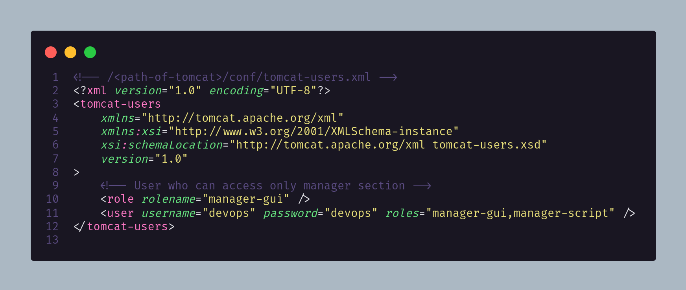
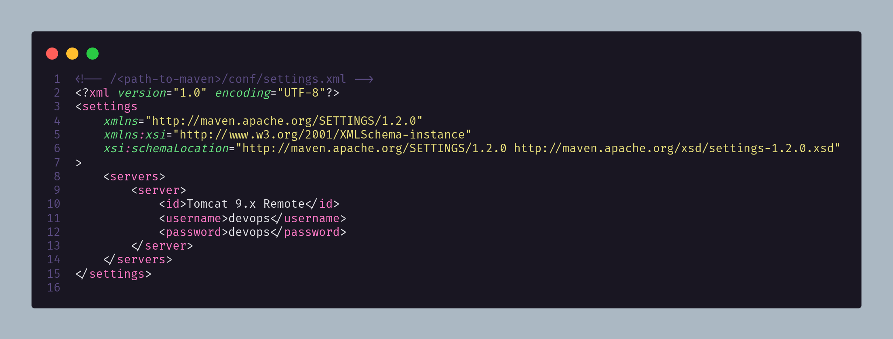
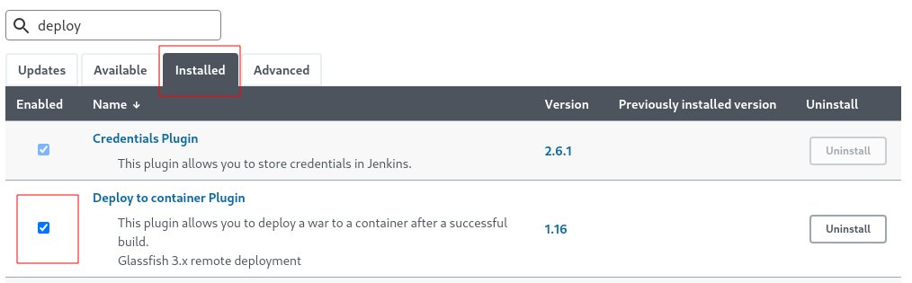
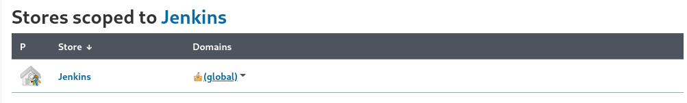
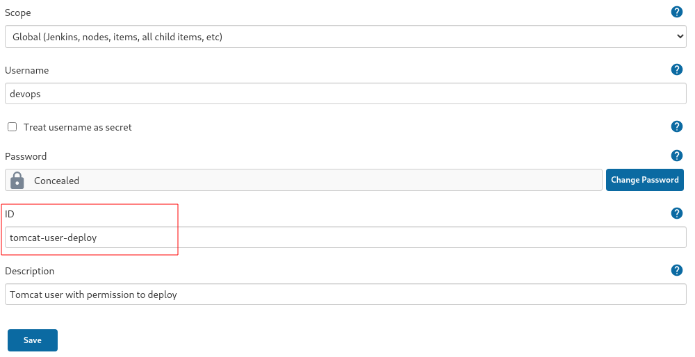
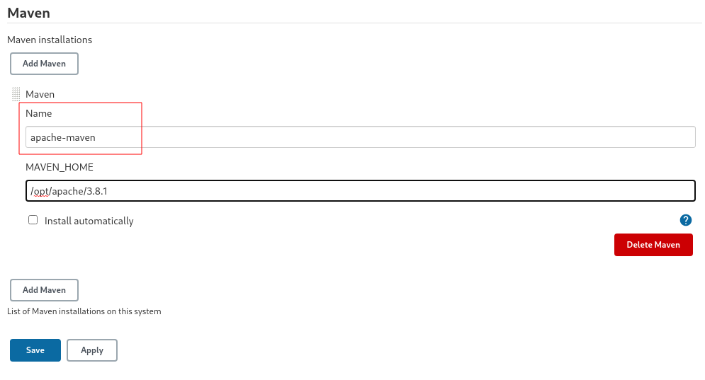

# Roadlovers JSP

Repositório: https://github.com/ozluuh/roadlovers-jsp.git

Demonstração: https://youtu.be/3uTvpBtpCts

## Requerimentos

### Apache Tomcat

**Apache Tomcat 9.x** configurado na porta **8080**;

Usuário de deploy no Tomcat: `/<path-of-tomcat>/conf/tomcat-users.xml`

### Apache Maven

Usuário configurado no Tomcat deve ser o mesmo configurado no Maven: `/<path-to-maven>/conf/settings.xml`

### Jenkins

#### Plugins

Acesse o menu lateral à esquerda a opção **Manage Jenkins**, em seguida **Manage Plugins** e certifique-se que na seção **Installed** tem o plugin **Deploy to container Plugin** instalado e habilitado. Caso contrário, instale ele a partir da seção **Available**.

#### Configuração de Usuário

Acesse o menu lateral à esquerda a opção **Manage Jenkins**, em seguida selecione **Manage Credentials** e clique em **(global)** conforme imagem a seguir:

No menu lateral à esquerda estará habilitada a opção **Add Credentials**, clique nela e entre com as mesmas credenciais cadastradas no Tomcat e clique em OK.

:warning: Obs.: Atente-se a opção demarcada para que esteja exatamente com o ID **tomcat-user-deploy**.

:exclamation: Essa marcação pode influenciar no Deploy.

#### Configuração da ferramenta Maven

Na tela principal do Jenkins, acesse o menu lateral à esquerda a opção **Manage Jenkins**, em seguida **Global Tool Configuration**. Na tela a seguir, desça até encontrar Maven. Clique em **Maven installations** e aponte para o caminho da instalação do Maven na mesma máquina onde se encontra instalado o Jenkins em seguida clique em **Save**.

:warning: Obs.: Tenha certeza de manter a mesma nomenclatura no Name para **apache-maven**, caso contrário, o pipeline pode ocasionar em erros.

Retorne à tela principal e crie o Pipeline conforme demonstrado em vídeo.
